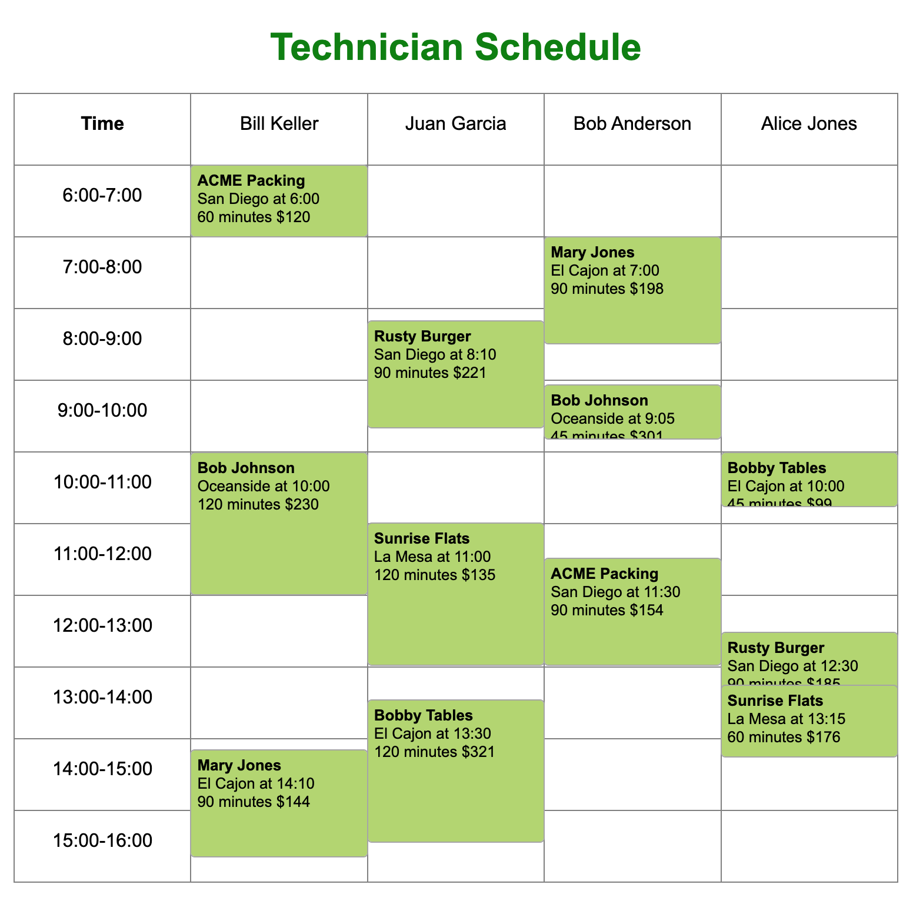

# Technician Schedule App

Ruby Version 3.2.2

## Screenshot

## Installation

1. Fork and clone this repository.
2. Run `bundle install` to install gems.
3. Ensure that the "app/assets/scheduling-data" folder contains these three .csv files. This repository does include them for convenience, but the database population will not work unless they are in that file and named correctly.
   - locations.csv
   - technicians.csv
   - work_orders.csv
4. Run `rake import` in the terminal. This will clear any existing database, migrate a new one with the approprate model architecture, and populate the database with data from the .csv files.
5. Run `rails s` to start the server and navigate to http://localhost:3000/ in your browser.

## Developer Notes

As I am completely new to Ruby on Rails, I met quite a few challenges in the development process. A few key notes:

- The first success was a functional rake task in [scheduling.rake](https://github.com/bencapp/capp_terrier_assessment/blob/main/lib/tasks/scheduling.rake), but the task was not idempotent, so I created another 'wrapper' rake task that would drop and migrate the table before importing the data. This way `rake import` has the same effect every time it runs.
- I initially designed the user interface using exclusively <b>css grid</b>, which was an effective way to accurately and precisely place the green work order boxes in their respective time slots. However, this made the last requirement of the assignment difficult. How are we to measure the time in between work orders when there are no directly corresponding elements being rendered to the DOM? After trying many ideas, my solution was to render each column as a <b>css flexbox</b> instead, and render invisible boxes in between each work order. The amount of free time is stored as a data attribute on those elements and is now easily accessible.

## Possible Improvements

- Displaying the work orders with flexboxes is functional, but the alignment of the green boxes is not very precise. From a UI perspective, it would be better to use grid and find a different solution to the available time popup requirement.
- I developed and tested the app using only one set of data. Different data sets should be tested to ensure that the app works with a variety of edge cases.
- Styling is defined mainly using pixels, which does not facilitate responsiveness. The app is not prepared to function on multiple platforms.
- I used jQuery for the client-side conditional rendering, and it didn't play that well with Rails; it's just what I know and am comfortable with. It would be better to use a more modern tool that is designed to work alongside Rails.
